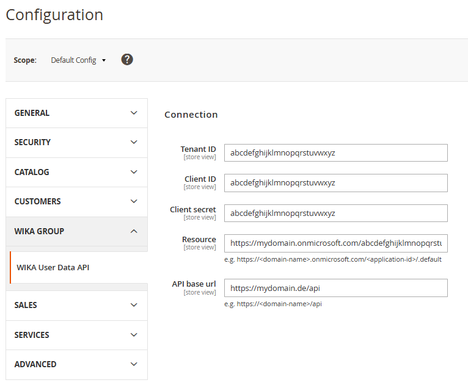

# Mage2 Module WIKA User Data API

Magento2 Module to encapsulate the access to the WIKA user data azure API.

For example of response see internal wiki.

## Configuration
The configuration can be found in the admin backend under:  
`Stores` -> `Settings` -> `Configuration` -> `WIKA GROUP` -> `WIKA User Data API`

